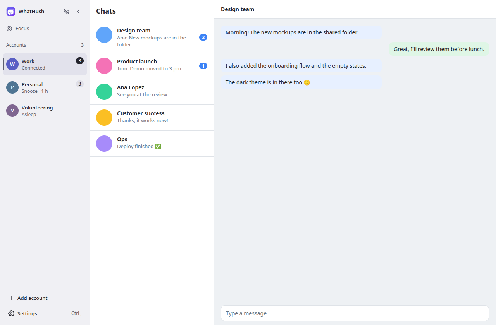
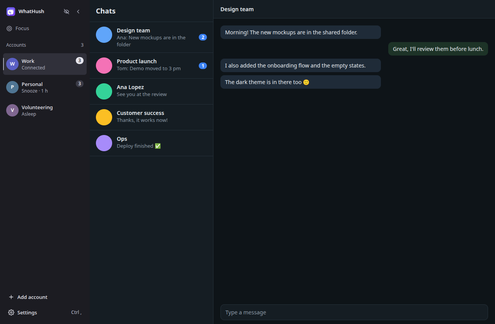
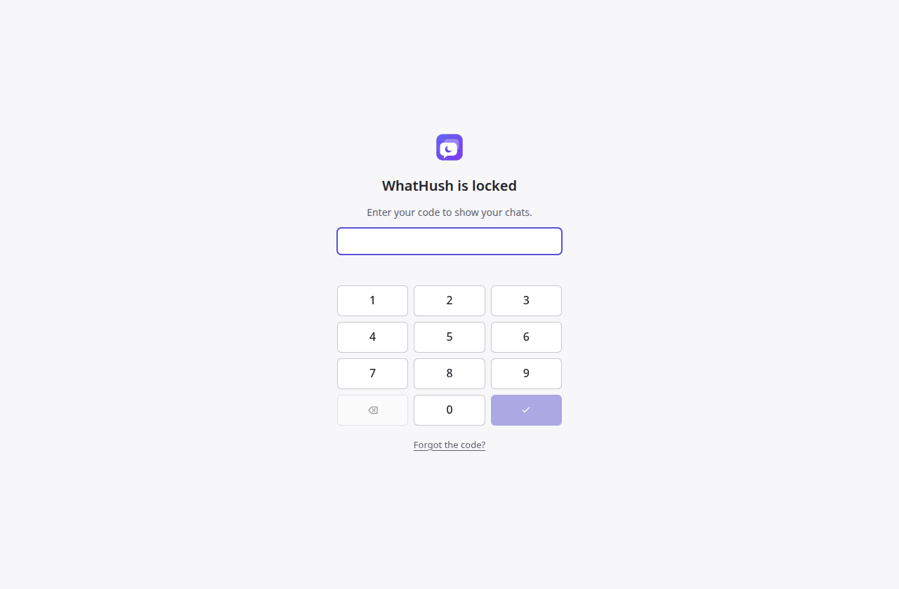
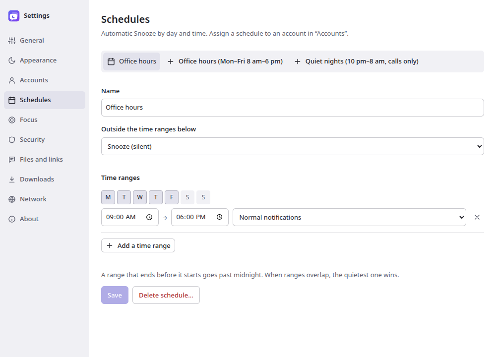

<p align="center">
  
</p>

<h1 align="center">WhatHush</h1>

<p align="center">
  <b>All your WhatsApp accounts in one calm Linux app.</b><br>
  Keep work, personal and side-project numbers side by side, and decide when each one is allowed to interrupt you.
</p>

<p align="center">
  <a href="https://github.com/chapdel/whathush/releases/latest"></a>
  <a href="LICENSE"></a>
  
</p>

<p align="center">
  
</p>

WhatsApp Web lets you use one account per browser. WhatHush opens the official WhatsApp Web for as many accounts as you need, each in its own isolated session, and adds what a desktop app should have: quiet hours, a lock, a privacy veil, and proper Linux integration.

## Features

### All your accounts, side by side

- **Every account stays connected**: each one lives in its own isolated session, with no logging out and no scanning a QR code every morning.
- **Switch instantly** with `Ctrl+1` … `Ctrl+9` or `Ctrl+Tab`, even while typing in a chat.
- **Know what's waiting**: unread counts per account in the sidebar, the tray icon and the launcher.
- **Notifications that make sense**: each one says which account it's for, and clicking it opens the right chat in the right account.

### Quiet when you need it

- **Snooze** an account for 30 minutes, an hour, until tomorrow morning, until Monday, or until you turn it back on.
- **Schedules**: your work account goes quiet outside office hours, automatically.
- **Focus profiles**: one click for "Meeting" or "Weekend", with calls only or complete silence, account by account.
- **Deep sleep**: put an account you rarely use to sleep to free its memory; it wakes up without a QR code.
- **Voice messages keep playing** when you switch accounts, with Pause and Resume in the sidebar and the tray.

### Light on resources

- **WhatsApp rests when nobody is looking**: when you step away, lock your screen or minimize the window (Wayland included), the account on screen is hidden. It stays connected and keeps notifying you, but stops running at full speed and marks nothing as read; it's back the moment you return.
- **Saver mode**, account by account: a hidden account sleeps and checks for messages every 15, 30 or 60 minutes, freeing its memory. Optionally, every account switches to it while WhatHush sits in the tray.
- **Gentle start-up**: accounts load one after the other, and only once your desktop has settled when WhatHush starts in the tray.
- **No slow creep over the days**: a hidden account whose page has doubled in size is quietly reloaded while you're away, and caches are capped.

### Private by design

- **Lock with a code**: at start-up, when the window is hidden, after inactivity, or together with your desktop session.
- **Privacy veil** (`Ctrl+Shift+H`): hides your chats on demand, and optionally when you share your screen or leave the window.
- **No stray read receipts**: only the account on screen is active; the others don't mark messages as read.
- **Per-account permissions** for microphone, camera, location and screen sharing.
- **Proxy support** (HTTP, HTTPS, SOCKS5), globally or per account, with encrypted credentials.
- **No server, no analytics, no tracking.** WhatHush talks to no one but WhatsApp, and never stores or logs your messages.

### At home on Linux

- Native notifications, a tray icon with the unread count, and Wayland or X11.
- Screen sharing through the desktop portal, offline spell checking in English and French.
- Light and dark themes, adjustable zoom per account, and a keyboard shortcut sheet (`Ctrl+/`).
- Interface in English and French, following your system language.

<p align="center">
  
  
</p>
<p align="center">
  
</p>

## Install

Download the package for your system from the [latest release](https://github.com/chapdel/whathush/releases/latest):

| System | Package | Install |
|---|---|---|
| Fedora | `.rpm` | `sudo dnf install ./whathush-0.2.0.x86_64.rpm` |
| Debian, Ubuntu and derivatives | `.deb` | `sudo apt install ./whathush_0.2.0_amd64.deb` |
| Any distribution | `.AppImage` | `chmod +x WhatHush-0.2.0-x86_64.AppImage`, then run it; it updates itself |

The AUR package (`whathush-bin`) and Flathub are on their way. `SHA256SUMS` in each release lets you check your download.

**First launch**: click *Add account*, then scan the QR code from your phone (WhatsApp → *Linked devices*). Each account uses one linked device, and WhatsApp allows up to four per phone number.

## FAQ

**Is WhatHush an official WhatsApp app?**
No. It's an independent project, not affiliated with WhatsApp LLC or Meta Platforms. It displays the official WhatsApp Web and doesn't reimplement any protocol, so your chats stay end-to-end encrypted exactly as in a browser.

**Where are my accounts stored?**
On your computer only, in `~/.config/mcdesk/`, readable by your user alone. Logs never contain message content. *Settings → About → Create a diagnostic report* produces a redacted file you can attach to a bug report; nothing is ever sent automatically.

**Can I make calls?**
WhatHush gives WhatsApp Web access to your microphone, camera and screen sharing. Calls themselves depend on what WhatsApp Web offers, and are still being tested with real accounts.

**What's still experimental?**
A few features depend on details of WhatsApp Web or of your desktop and are still being checked with real accounts: calls and call notifications ("calls only" Focus), the per-message blur, notification photos, locking together with the desktop session on GNOME and KDE, and how WhatsApp notifies the messages a saver-mode account collects when it wakes up (WhatHush shows a "New messages" summary when it doesn't). The [test protocol](lab/README.md) lists everything that is being verified.

**Found a bug or have an idea?**
[Open an issue](https://github.com/chapdel/whathush/issues). A diagnostic report (see above) helps a lot.

## For developers

WhatHush is built with Electron, TypeScript and React. Each account is a `WebContentsView` with its own Chromium partition; all the logic that doesn't need Electron lives in `src/main/core/` and is unit tested.

<details>
<summary><b>Develop</b></summary>

```bash
npm install
npm start            # build, then run against the real web.whatsapp.com
npm run demo         # run against a local fake WhatsApp page (no account needed)
```

Data lives in `~/.config/mcdesk/` (mode 0700; `~/.config/mcdesk-demo/` for the demo). Logs are in `logs/app.log` and never contain message content.

</details>

<details>
<summary><b>Tests</b></summary>

| Command | What it checks |
|---|---|
| `npm run typecheck` | types across the whole project |
| `npm test` | 246 unit tests: policy, Snooze/Focus expiry, time zones, state machine, account manager and its start-up queue, links, storage and v1 → v3 migrations, menus, IPC, the `app://` protocol, autostart, language catalogues, shortcuts, media playback, download history, permissions, lock and its session watchers, proxy and SOCKS5 relay (against a fake upstream proxy), encrypted credentials, veil, redacted report, context menu, tray menus, notification photos, spell checker, presence, saver mode, recycling, single instance |
| `npm run test:e2e` | 58 end-to-end tests (Playwright drives Electron headless against the fake page): keyboard, dialogs, resizing, themes and HiDPI, English interface, clipboard, playback, zoom, downloads, report, lock, veil, permissions, HTTP and SOCKS5 proxies, notification photos, hidden window and away detection, saver mode and its summary notification, recycling; screenshots go to `test-results/screens/` |
| `npm run test:native` | the visibility rule measured without Playwright (Playwright emulates page focus, which would skew the result), including while locked, when the window stops being drawn and when the user steps away, and Snooze muting a sound started by a hidden page |
| `npm run test:kwin` | a window minimized by KWin (which Electron doesn't see on Wayland) hides WhatsApp; runs in a nested, off-screen KWin and is skipped when `kwin_wayland` is missing |
| `npm run bench` | resource benchmark (memory and CPU per process, read from `/proc`) on a synthetic signed-in page; `-- --scenario hidden\|visible\|minimized\|away\|economy\|tray\|startup`, `--real` for web.whatsapp.com (signed out), `--check` fails beyond the regression thresholds checked in CI; results in `test-results/bench/` |
| `npm run build && ./node_modules/.bin/playwright test --config playwright.native.config.ts` | windows and tray on the current desktop, Wayland and X11 backends depending on the session; uses local test accounts |
| `cd lab && npm run smoke` | the [Feasibility Lab](lab/README.md) smoke test |
| `npm run icons` | regenerates the numbered tray icons (ImageMagick) |

When launched from KDE Wayland, the X11 backend runs through XWayland. Automated screenshots use the fake WhatsApp page.

</details>

<details>
<summary><b>Packages</b></summary>

```bash
npm run build && npx electron-builder --linux AppImage tar.gz --publish never   # on the host
# .deb and .rpm: fpm needs libcrypt.so.1 (missing from Fedora 44) and rpmbuild,
# hence a container:
podman run --rm --security-opt label=disable -v "$PWD":/work -w /work \
  registry.fedoraproject.org/fedora:44 bash -c \
  "dnf install -y nodejs rpm-build libxcrypt-compat && npx electron-builder --linux rpm deb --prepackaged release/linux-unpacked --publish never"
# Flatpak, built from source and offline, like on Flathub
# (--no-documents-portal only works around a broken document portal on the host)
flatpak run --no-documents-portal org.flatpak.Builder --user --install-deps-from=flathub --force-clean \
  --repo=release/flatpak-repo release/flatpak-build packaging/flatpak/io.github.chapdel.whathush.yml
flatpak build-bundle release/flatpak-repo release/WhatHush-0.2.0.flatpak io.github.chapdel.whathush
```

After any change to `package-lock.json`, regenerate the Flatpak's npm sources with `packaging/flatpak/update-sources.sh` (needs [flatpak-node-generator](https://github.com/flatpak/flatpak-builder-tools/tree/master/node)). `npm run screenshots` regenerates the AppStream screenshots in `packaging/screenshots/`.

`whathush --self-test` actually starts the packaged application (with its fuses enabled), checks that the interface renders and prints a JSON summary, including the build fingerprint (`build`: commit and date). Comparing that fingerprint with `dist/build-info.json` proves the package contains the expected build rather than a stale cached one.

| Format | How it is verified |
|---|---|
| AppImage | self-test with interface rendering |
| `.deb` | installed in Ubuntu 24.04: dependencies, files, desktop entry, AppArmor profile, self-test with rendering |
| `.rpm` | installed in Fedora 44: dependencies, valid desktop entry, self-test with rendering |
| AUR (`packaging/aur/PKGBUILD`) | `makepkg` (checksums verified), then `pacman -U` in Arch Linux, self-test with rendering |
| Flatpak | built from source on the Electron 26.08 base app with zypak, installed, self-test with rendering inside the real sandbox, uninstalled |

The packaged binary has its Electron fuses set: no `RunAsNode`, no `NODE_OPTIONS`, no `--inspect`, cookie encryption on, and the app loads only from its ASAR archive.

</details>

<details>
<summary><b>Architecture</b></summary>

```text
src/
  shared/                 constants, identity, zod schemas, IPC contract, display formats
  shared/i18n/            English and French catalogues
  main/core/              pure logic without Electron: policy, time zones, states, links,
                          permissions, menus, resources, adapter, lock, proxy, playback
  main/storage/           configuration files: atomic writes, migrations
  main/sessions/          hardened session factory
  main/views/             WebContentsView per account, visibility rule
  main/accounts/          account life cycle, crash recovery
  main/notifications/     notification interception and display
  main/policy/            Snooze, Focus and schedules applied
  main/links/             link and popup routing
  main/whatsapp-adapter/  the only code that reads WhatsApp's content
  main/security/          passcode lock
  main/privacy/           privacy veil
  main/proxy/             proxy and local SOCKS5 relay
  main/diagnostic/        diagnostic report
  main/app.ts             wiring, UI state, commands, IPC
  preload/                shell (typed API) and WhatsApp views (interception)
  renderer/               React interface: sidebar, home, dialogs, settings
tests/                    unit, end-to-end (fake WhatsApp page), native
packaging/                desktop entry, AppStream, PKGBUILD, Flatpak manifest
lab/                      Feasibility Lab, a separate throwaway project
```

</details>

<details>
<summary><b>Releasing</b></summary>

1. Bump `version` in `package.json` and `pkgver` in `packaging/aur/PKGBUILD`, and add a `<release>` entry to `packaging/linux/io.github.chapdel.whathush.metainfo.xml`: its English text becomes the release notes.
2. Commit, then push a tag: `git tag v0.2.0 && git push origin master v0.2.0`. The [Release workflow](.github/workflows/release.yml) runs every test, builds the packages and creates a **draft** release with `SHA256SUMS` and `latest-linux.yml`.
3. Check the draft on GitHub, then publish it. Running AppImages pick up the update from then on.
4. **AUR**: `git clone ssh://aur@aur.archlinux.org/whathush-bin.git ../whathush-bin`, then `packaging/aur/update.sh ../whathush-bin` (checksums and `.SRCINFO`, computed in an Arch container with podman), then commit and push in `../whathush-bin`.
5. **Flathub**: `packaging/flatpak/prepare-flathub.sh <folder>` writes the manifest pinned to the tag, the npm sources and `flathub.json`. The first time, open a pull request against the `new-pr` branch of [flathub/flathub](https://github.com/flathub/flathub); afterwards, commit to the app's own Flathub repository.

</details>

## License

WhatHush is free software, released under the [GNU General Public License v3.0 or later](LICENSE). The bundled spell-checking dictionaries keep their own licenses (MPL 2.0 for French, SCOWL for English); see `build/dictionaries/NOTICE.txt`.
